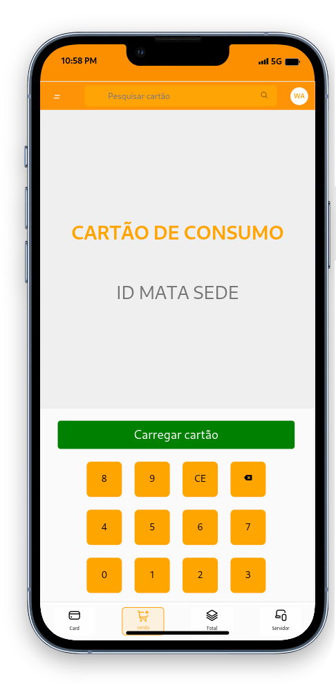

# digital_card_bar
**This GitHub repo (<https://github.com/Genymobile/scrcpy>) is the only official
source for the project. Do not download releases from random websites, even if
their name contains `scrcpy`.**

# Controle de vendas

_pronounced "**scr**een **c**o**py**"_

This application mirrors Android devices (video and audio) connected via
USB or [over TCP/IP](doc/connection.md#tcpip-wireless), and allows to control the
device with the keyboard and the mouse of the computer. It does not require any
_root_ access. It works on _Linux_, _Windows_ and _macOS_.

